<div align="center">
  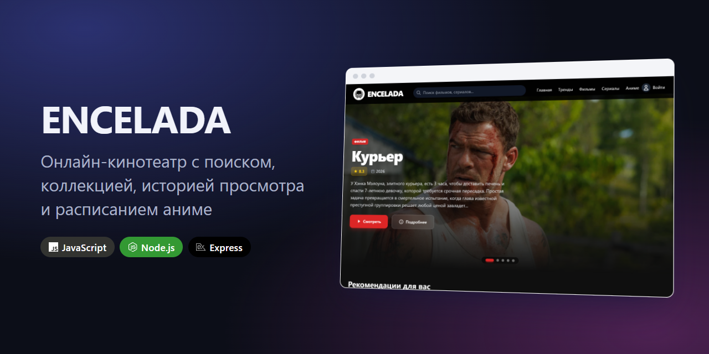
  <h1> ENCELADA</h1>
  <p><strong>A web cinema for movies, series and anime: a searchable catalog, a personal library, watch history and an airing schedule for ongoing anime.</strong></p>
  <p>
    <a href="#run-locally">Run it</a> ·
    <a href="#features">Features</a> ·
    <a href="#demo">Demo</a> ·
    <a href="#how-it-works">How it works</a> ·
    <a href="ARCHITECTURE.md">Architecture</a> ·
    <a href="README.md">Русский</a>
  </p>
  <p>
    
    
    
    
  </p>
</div>

<div align="center">
  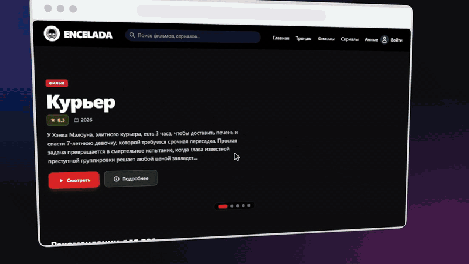
</div>

<sub>Recorded from the locally running app with the scenario in <a href="demo.scenario.yaml">demo.scenario.yaml</a>. Catalog titles and banners come from the connected APIs and change over time. The interface is in Russian.</sub>

## Features

- Separate catalogs for movies, series, anime and trends.
- Search and genre filters; popular over 1, 7 and 30 days.
- For anime: ongoing titles and a weekly schedule based on TMDB air dates.
- Title page: description, trailer, cast and creators, rating, comments with voting.
- Accounts, a personal library, watch history and playback progress; Telegram sign-in when a bot is configured.
- Interface preferences and an 18+ content filter.
- Russian-language interface and TMDB queries; user data and cache in SQLite.

## Demo

Everything below is recorded from the locally running app; the 3D staging was added in editing.

| Live search | Anime: ongoing titles and schedule |
|---|---|
| 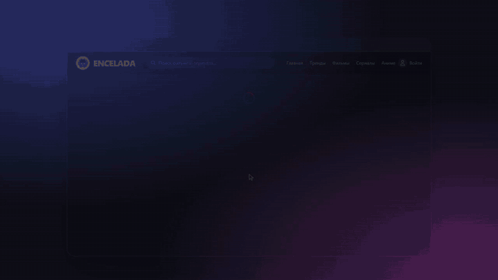 | 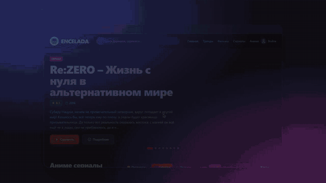 |

### Pages

| Carousel | Cube |
|---|---|
| 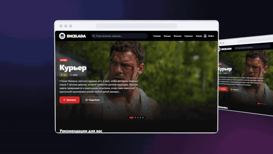 | 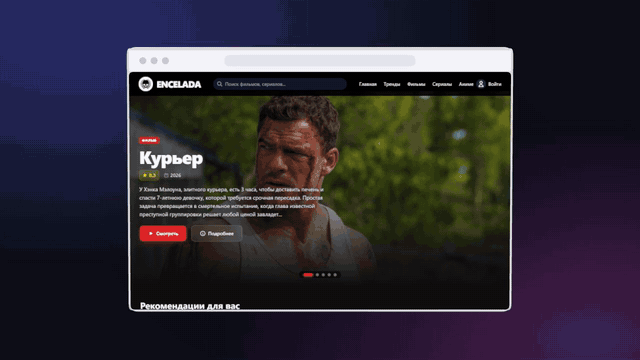 |

| Stack | Wall |
|---|---|
| 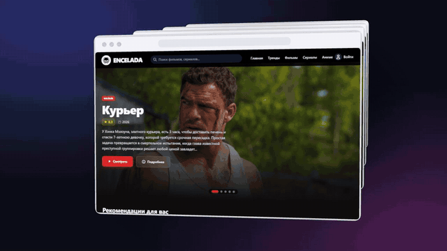 | 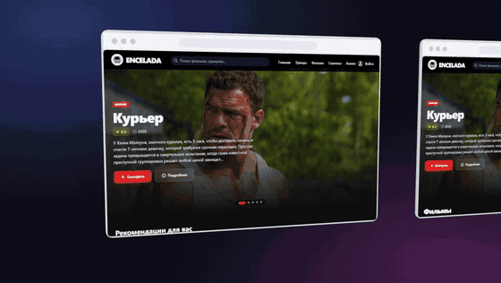 |

### On a computer and on a phone

| Laptop and phone | Mobile layout |
|---|---|
| 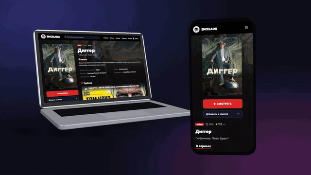 | 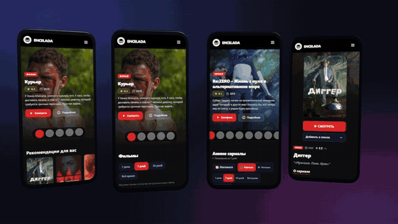 |

## Interface

| Home | Anime catalog |
|---|---|
|  |  |

| Title page | Profile and statistics |
|---|---|
| 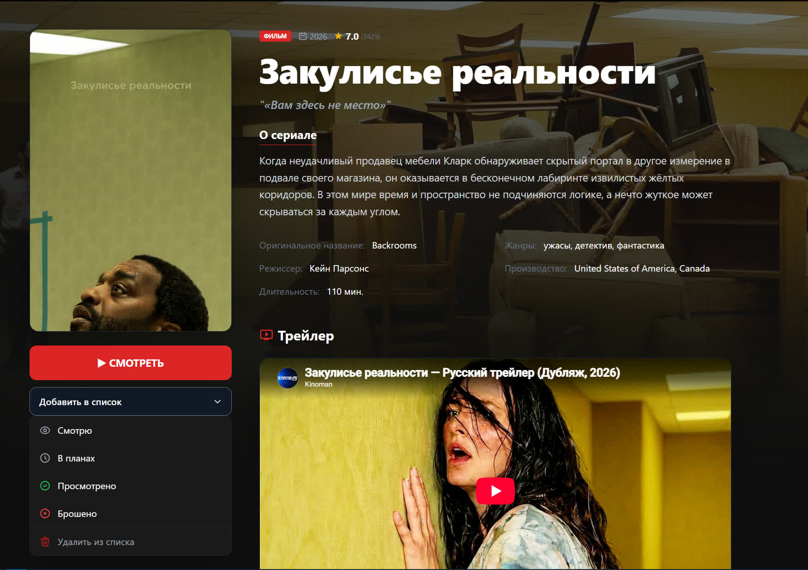 |  |

<details>
<summary>More screenshots: movies, series, trends, comments, statistics, sign-in</summary>

| Movies | Series |
|---|---|
|  |  |

| Anime | Anime: ongoing banner |
|---|---|
|  | 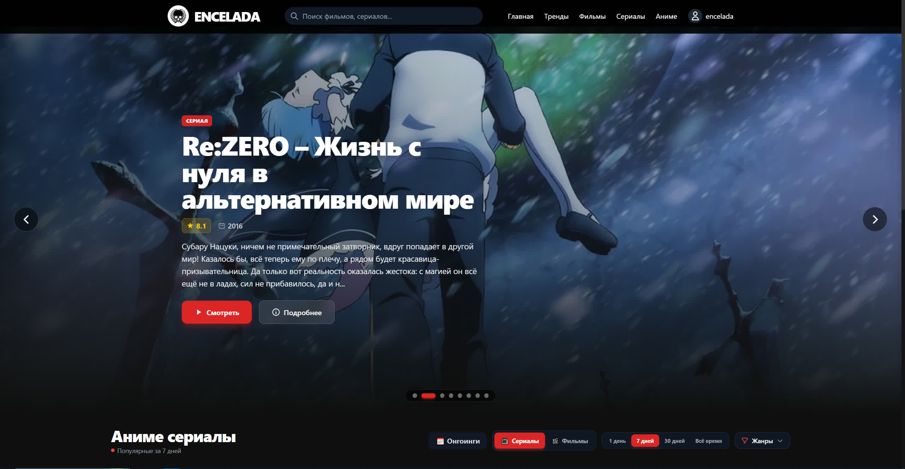 |

| Trends and filters | Cast and rating |
|---|---|
|  |  |

| Comments | Watch statistics |
|---|---|
|  |  |

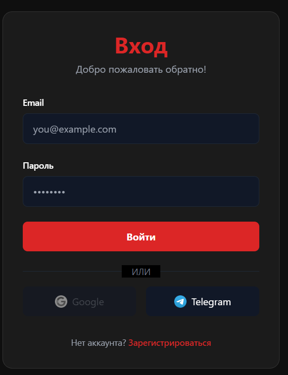

</details>

## Run locally

You need Node.js 20 or later, npm and a [TMDB API](https://www.themoviedb.org/settings/api) key. No separate SQLite install is required: the app uses `better-sqlite3`.

```bash
git clone https://github.com/ArabKustam/encelada-film.git
cd encelada-film
npm install
```

Create `.env` from the template and put your `TMDB_API_KEY` in it:

```bash
cp .env.example .env
```

In Windows PowerShell use `Copy-Item .env.example .env` instead of `cp`.

```bash
npm start
```

Open the address printed in the terminal. The default port is `3000`; if it is taken and `PORT` is not set, the server tries the next free one. The SQLite database is created at `data/cinema.db`.

## Configuration

The server reads five environment variables:

| Variable | Required | Used for |
|---|---|---|
| `TMDB_API_KEY` | yes | catalog, search, title pages |
| `PORT` | no | server port, `3000` by default |
| `FANART_API_KEY` | no | backgrounds and logos from Fanart.tv; without the key they are simply not shown |
| `TELEGRAM_BOT_TOKEN` | no | Telegram sign-in |
| `TELEGRAM_BOT_NAME` | no | Telegram sign-in |

The other lines of the [`.env.example`](.env.example) template are not used by the current server. Do not commit `.env` or real keys.

## How it works

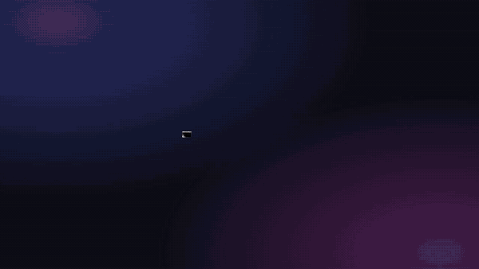

The walk-through is built from the code: links are imports and the pages' calls to `/api/*`, captions are real routes from `server.js` with line numbers (captions are in Russian).


There is no bundler: pages load browser ES modules directly, and the server serves static files and the API. The module map and notes on collections and the content filter are in [ARCHITECTURE.md](ARCHITECTURE.md) (in Russian).

## Tests

```bash
node --test tests/*.test.cjs
```

Regression checks for the 18+ settings, history, collections, the API and protected static files. They do not modify the user database.

## Limitations

- Authentication is simplified: the session token is not signed and passwords are hashed with unsalted SHA-256. The project is meant to run locally; replace the authentication before deploying it publicly.
- The catalog depends entirely on external APIs: without `TMDB_API_KEY` and a network connection the pages stay empty.
- Dates in the anime schedule are original air dates from TMDB; the source has no dates for Russian dubs.
- The repository has no license file yet.

## Credits

Catalog data and imagery are provided by [The Movie Database (TMDB)](https://www.themoviedb.org/). This project is not endorsed by or affiliated with TMDB. Please follow the terms of the APIs and services you connect.

<div align="center"><sub>Built for people who love a good story.</sub></div>
