<div align="center">
  
  <h1>ENCELADA</h1>
  <p><strong>A web cinema for movies, series and anime: a searchable catalog, a personal library, watch history and an airing schedule for ongoing anime.</strong></p>
  <p>
    <a href="#what-is-inside">What is inside</a> ·
    <a href="#run-locally">Run it</a> ·
    <a href="#how-it-is-built">How it is built</a> ·
    <a href="README.md">Русский</a>
  </p>
  <p>
    
    
    
    
  </p>
</div>

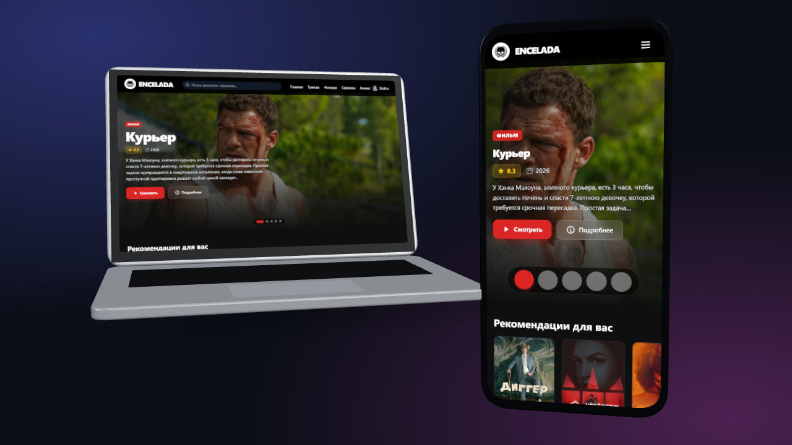

The interface is in Russian.

## What is inside

### Home and collections

The home page has a banner with new titles and rows of collections: recommendations, popular movies and series. Rows scroll sideways and a card opens the title page. Movies, series, anime and trends also have pages of their own, with genre filters and popularity over 1, 7 and 30 days.

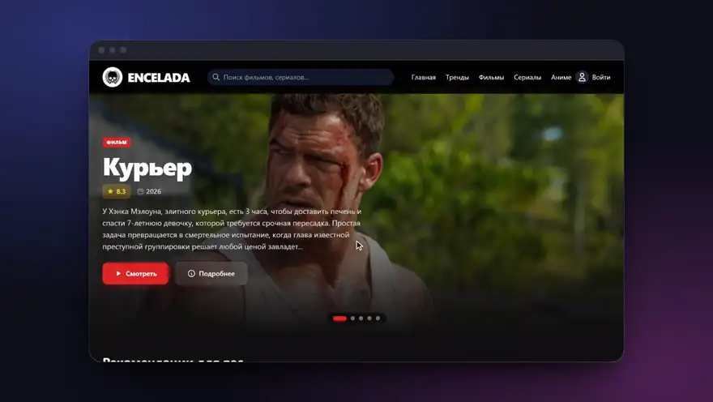

### Search

Results appear under the box as you type: the best match large, the rest as a list. The search box is in the header of every page.

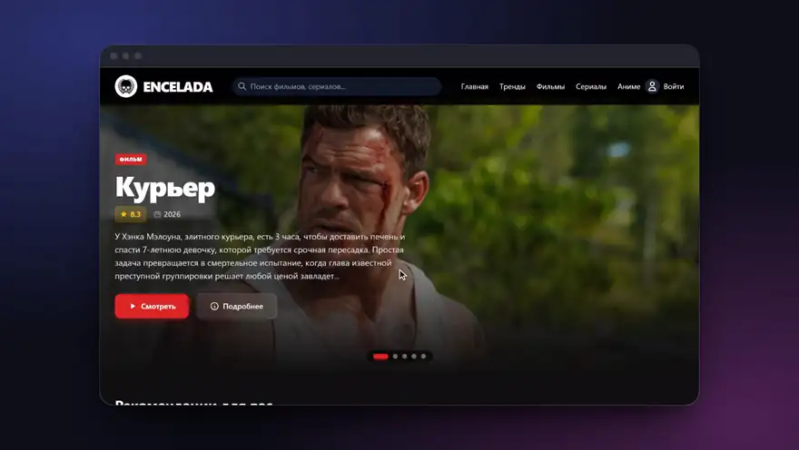

### Title page

Description, trailer, cast and creators, a ten-point rating and comments with voting. A title is added to your list from here.

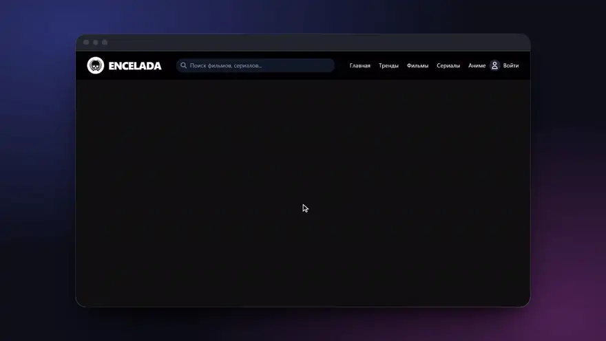

### Anime: ongoing titles and schedule

Anime has a section of its own. The "Ongoing" tab lays out the episodes airing this week by day, using original air dates from TMDB.

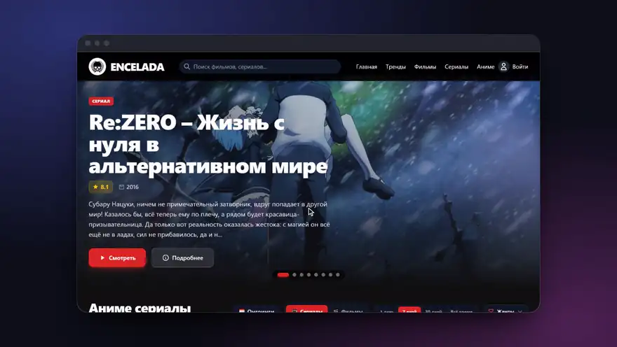

### Profile

An account keeps a personal library, watch history and playback progress, and the profile shows statistics over them. Sign in with email and password, or through Telegram when a bot is configured.

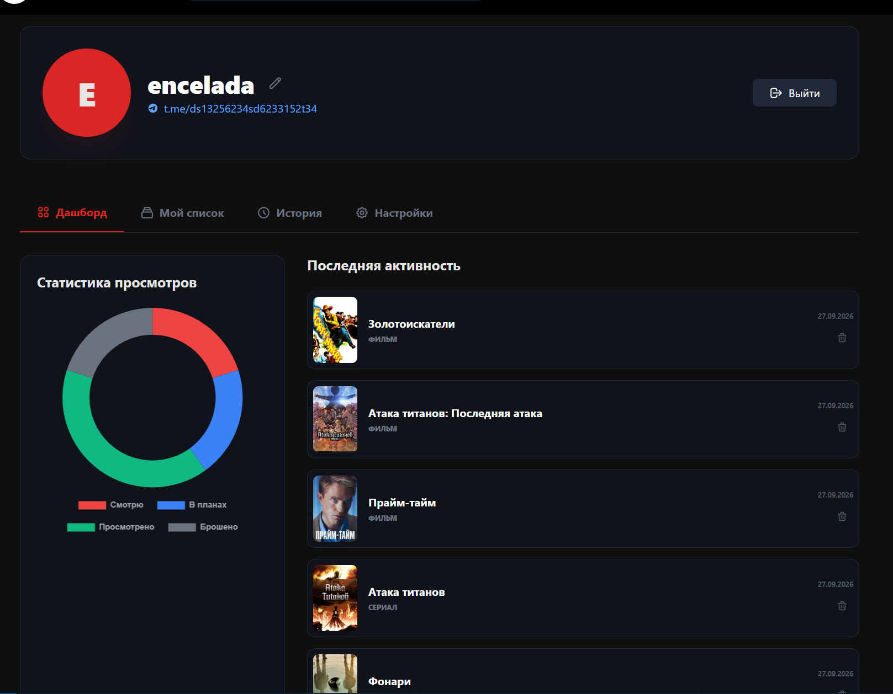

There are also interface preferences and an 18+ content filter.

<details>
<summary>More screenshots</summary>

| Movies | Series |
|---|---|
|  |  |

| Anime catalog | Trends and filters |
|---|---|
| 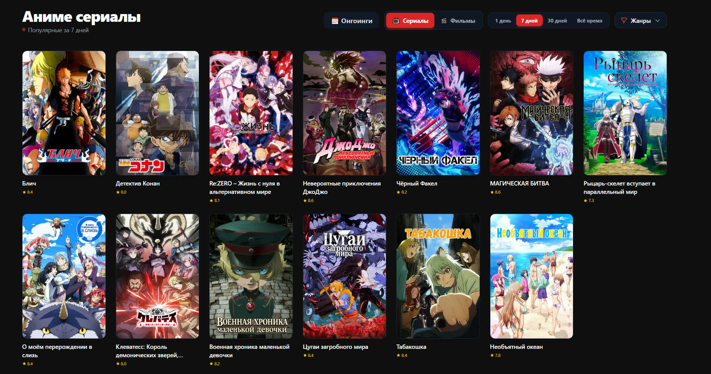 | 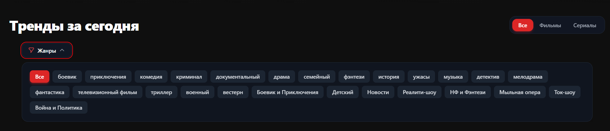 |

| Cast and rating | Comments |
|---|---|
| 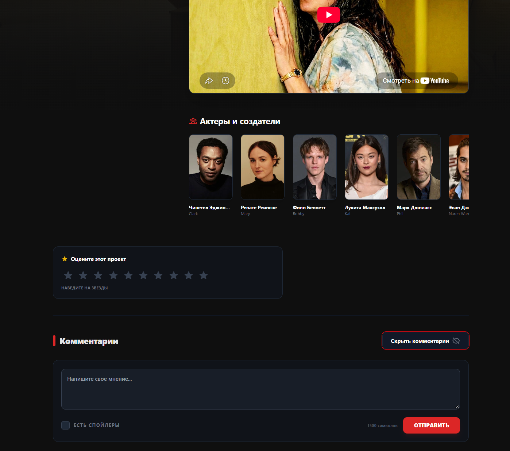 | 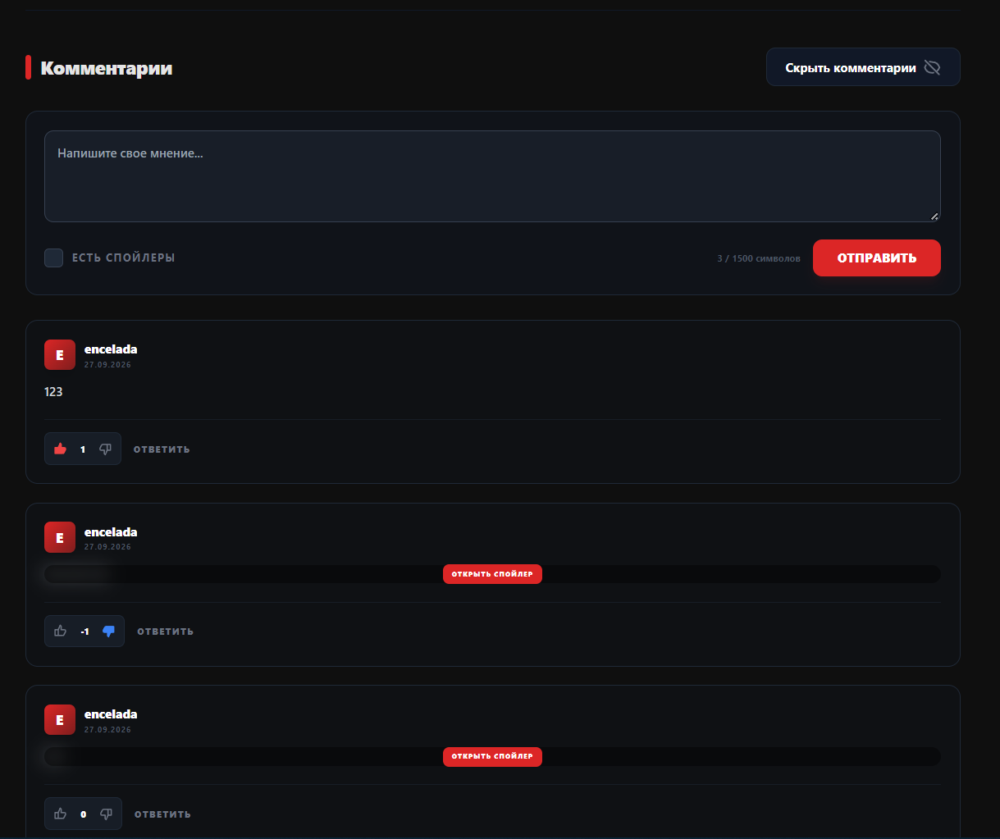 |

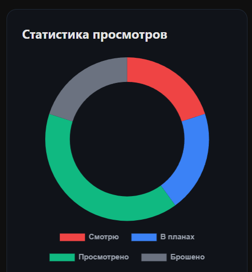

</details>

## Run locally

You need Node.js 20 or later, npm and a [TMDB API](https://www.themoviedb.org/settings/api) key. No separate SQLite install is required: the app uses `better-sqlite3`.

```bash
git clone https://github.com/ArabKustam/encelada-film.git
cd encelada-film
npm install
```

Create `.env` from the template and put your `TMDB_API_KEY` in it:

```bash
cp .env.example .env
```

In Windows PowerShell use `Copy-Item .env.example .env` instead of `cp`.

```bash
npm start
```

Open the address printed in the terminal. The default port is `3000`; if it is taken and `PORT` is not set, the server tries the next free one. The SQLite database is created at `data/cinema.db`.

## Configuration

| Variable | Required | Used for |
|---|---|---|
| `TMDB_API_KEY` | yes | catalog, search, title pages |
| `PORT` | no | server port, `3000` by default |
| `FANART_API_KEY` | no | backgrounds and logos from Fanart.tv; without the key they are simply not shown |
| `TELEGRAM_BOT_TOKEN` | no | Telegram sign-in |
| `TELEGRAM_BOT_NAME` | no | Telegram sign-in |

The other lines of the [`.env.example`](.env.example) template are not used by the current server. Do not commit `.env` or real keys.

## How it is built

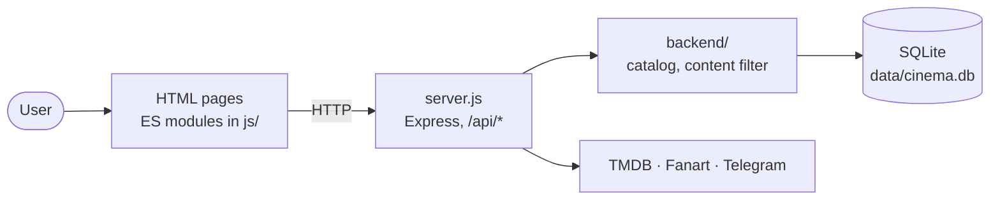

There is no bundler: pages load browser ES modules directly; the server serves static files and the API, and caches responses of the external APIs in SQLite. The module map and notes on collections and the content filter are in [ARCHITECTURE.md](ARCHITECTURE.md) (in Russian).

## Tests

```bash
node --test tests/*.test.cjs
```

Regression checks for the 18+ settings, history, collections, the API and protected static files. They do not modify the user database.

## Limitations

- Authentication is simplified: the session token is not signed and passwords are hashed with unsalted SHA-256. The project is meant to run locally; replace the authentication before deploying it publicly.
- The catalog depends entirely on external APIs: without `TMDB_API_KEY` and a network connection the pages stay empty.
- The anime schedule uses original air dates; TMDB has no dates for Russian dubs.
- The repository has no license file yet.

## Credits

Catalog data and imagery are provided by [The Movie Database (TMDB)](https://www.themoviedb.org/). This project is not endorsed by or affiliated with TMDB. Please follow the terms of the APIs and services you connect.
