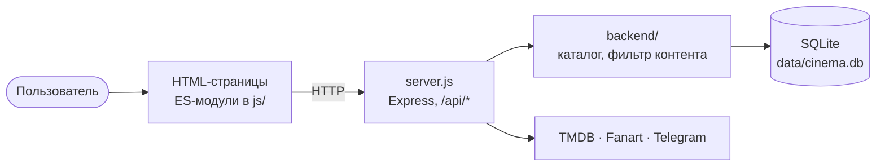

<div align="center">
  
  <h1>ENCELADA</h1>
  <p><strong>Веб-кинотеатр для фильмов, сериалов и аниме: каталог с поиском, личная библиотека, история просмотра и расписание онгоингов.</strong></p>
  <p>
    <a href="#что-внутри">Что внутри</a> ·
    <a href="#запуск-локально">Запуск</a> ·
    <a href="#как-устроено">Как устроено</a> ·
    <a href="README.en.md">English</a>
  </p>
  <p>
    
    
    
    
  </p>
</div>


## Что внутри

### Главная и подборки

На главной — баннер с новинками и ряды подборок: рекомендации, популярные фильмы и сериалы. Ряды листаются, карточка ведёт на страницу тайтла. У фильмов, сериалов, аниме и трендов есть и свои страницы с фильтрами по жанрам и по популярности за 1, 7 и 30 дней.


### Поиск

Результаты появляются под строкой по мере ввода: лучшее совпадение крупно, остальные списком. Строка поиска есть в шапке каждой страницы.


### Страница тайтла

Описание, трейлер, актёры и создатели, оценка по десятибалльной шкале и комментарии с голосованием. Отсюда же тайтл добавляется в личный список.


### Аниме: онгоинги и расписание

У аниме отдельный раздел. Вкладка «Онгоинги» раскладывает выходящие серии по дням текущей недели — по датам оригинального эфира из TMDB.


### Профиль

Аккаунт хранит личную библиотеку, историю и прогресс просмотра, а профиль показывает по ним статистику. Войти можно по почте и паролю или через Telegram, если настроен бот.


Ещё есть настройки интерфейса и фильтр контента 18+; интерфейс и запросы к TMDB — на русском языке.

<details>
<summary>Ещё скриншоты</summary>

| Фильмы | Сериалы |
|---|---|
|  |  |

| Каталог аниме | Тренды и фильтры |
|---|---|
|  |  |

| Актёры и оценка | Комментарии |
|---|---|
|  |  |


</details>

## Запуск локально

Нужны Node.js 20 или новее, npm и ключ [TMDB API](https://www.themoviedb.org/settings/api). SQLite ставить отдельно не нужно: используется пакет `better-sqlite3`.

```bash
git clone https://github.com/ArabKustam/encelada-film.git
cd encelada-film
npm install
```

Создайте `.env` из шаблона и впишите в него `TMDB_API_KEY`:

```bash
cp .env.example .env
```

В Windows PowerShell вместо `cp` — `Copy-Item .env.example .env`.

```bash
npm start
```

Откройте адрес, напечатанный в консоли. По умолчанию это порт `3000`; если он занят и `PORT` не задан, сервер попробует следующий свободный. База SQLite создаётся в `data/cinema.db`.

## Настройка

| Переменная | Обязательна | Для чего |
|---|---|---|
| `TMDB_API_KEY` | да | каталог, поиск, страницы тайтлов |
| `PORT` | нет | порт сервера, по умолчанию `3000` |
| `FANART_API_KEY` | нет | фоны и логотипы тайтлов с Fanart.tv; без ключа они просто не показываются |
| `TELEGRAM_BOT_TOKEN` | нет | вход через Telegram |
| `TELEGRAM_BOT_NAME` | нет | вход через Telegram |

Остальные строки шаблона [`.env.example`](.env.example) текущая версия сервера не использует. Не коммитьте `.env` и настоящие ключи.

## Как устроено



Сборщика нет: страницы подключают браузерные ES-модули напрямую, сервер отдаёт статику и API, а ответы внешних API кеширует в SQLite. Карта модулей, устройство подборок и фильтра контента — в [ARCHITECTURE.md](ARCHITECTURE.md).

## Тесты

```bash
node --test tests/*.test.cjs
```

Регрессионные проверки настроек 18+, истории, подборок, API и закрытой статики. Пользовательскую базу они не меняют.

## Ограничения

- Авторизация упрощённая: токен сессии не подписан, пароли хешируются SHA-256 без соли. Проект рассчитан на локальный запуск; перед публичным развёртыванием авторизацию нужно заменить.
- Каталог целиком зависит от внешних API: без `TMDB_API_KEY` и сети страницы останутся пустыми.
- В расписании аниме — даты оригинального эфира; сроки русской озвучки TMDB не даёт.
- Файла лицензии в репозитории пока нет.

## Благодарности

Данные и изображения каталога предоставляет [The Movie Database (TMDB)](https://www.themoviedb.org/). Этот проект не одобрен TMDB и не связан с ним. Соблюдайте условия использования подключённых API и сервисов.
