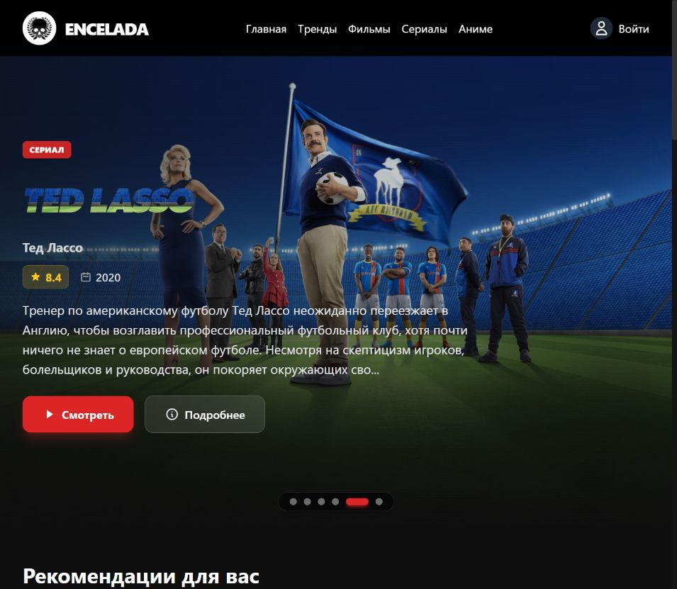
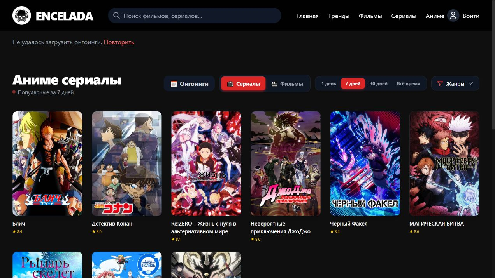
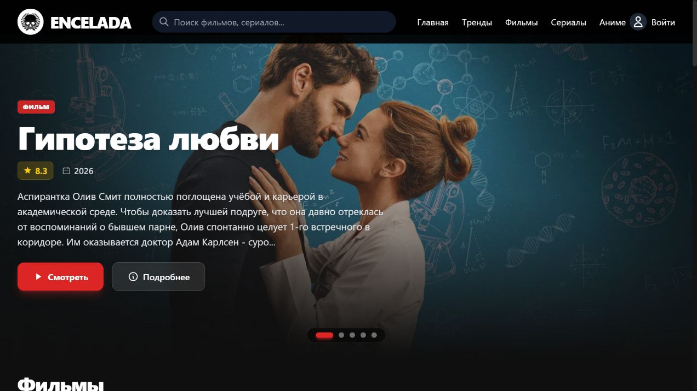
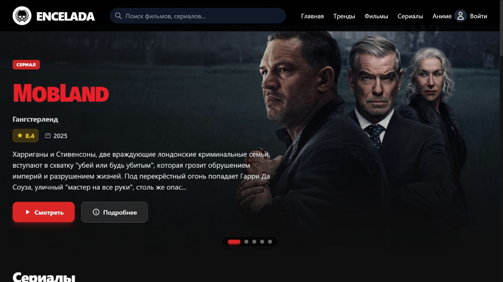
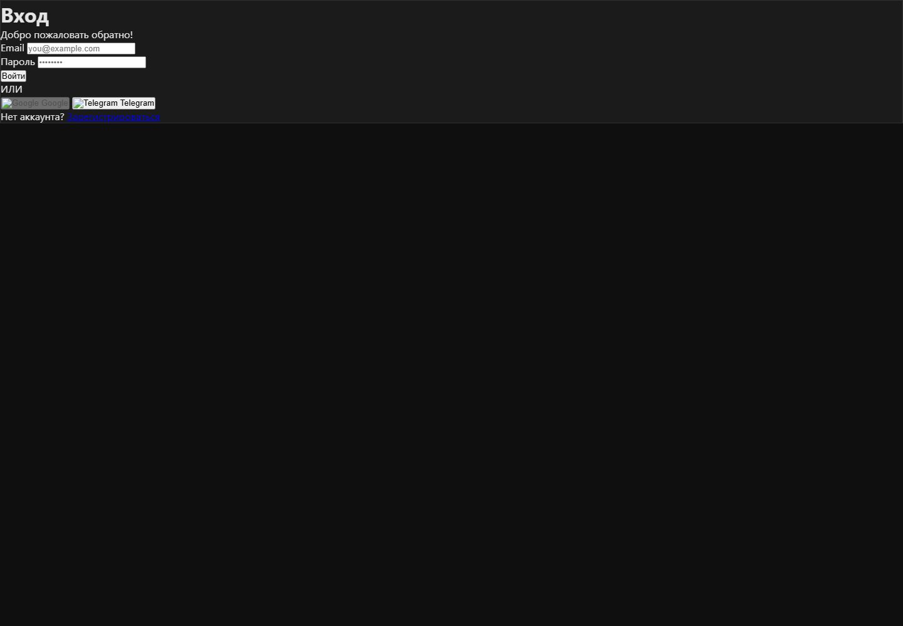
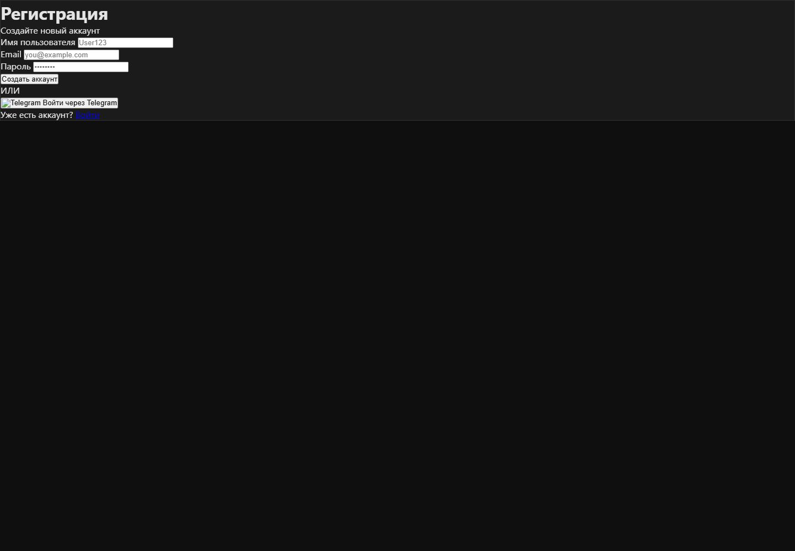

<div align="center">
  
  <h1>ENCELADA</h1>
  <p><strong>Movies, series, anime — all in one personal cinema.</strong></p>
  <p>Онлайн-кинотеатр с поиском, коллекцией, историей просмотра и расписанием аниме.</p>
  <p>
    
    
    
    
  </p>
  <p><a href="#ru">🇷🇺 Читать по-русски</a> &nbsp;·&nbsp; <a href="#en">🇬🇧 Read in English</a></p>
</div>

<div align="center">
  
  <p><strong>Скриншоты сняты в работающем приложении</strong> · Captured from the running app</p>
</div>

---

<a id="ru"></a>

## По-русски

**Encelada** — веб-кинотеатр для фильмов, сериалов и аниме. В каталоге есть поиск и подборки по периодам популярности; личный раздел хранит коллекцию и историю, а для аниме показывает отдельный обзор онгоингов.

### Демонстрация интерфейса

<table>
  <tr>
    <td width="50%"><a href="docs/media/home.jpg"></a><p align="center"><strong>Главная</strong><br>Настоящий баннер и каталог</p></td>
    <td width="50%"><a href="docs/media/anime.jpg"></a><p align="center"><strong>Аниме</strong><br>Реальный каталог и обложки тайтлов</p></td>
  </tr>
  <tr>
    <td width="50%"><a href="docs/media/movies.jpg"></a><p align="center"><strong>Фильмы</strong><br>Реальный каталог с подборками</p></td>
    <td width="50%"><a href="docs/media/series.jpg"></a><p align="center"><strong>Сериалы</strong><br>Реальный баннер и список сериалов</p></td>
  </tr>
  <tr>
    <td width="50%"><a href="docs/media/login.jpg"></a><p align="center"><strong>Вход</strong><br>Авторизация пользователя</p></td>
    <td width="50%"><a href="docs/media/register.jpg"></a><p align="center"><strong>Регистрация</strong><br>Создание нового аккаунта</p></td>
  </tr>
</table>

> Снимки сделаны в локально запущенном приложении. Состав каталога и баннеры загружаются из подключённых API и могут меняться.

### Возможности

- Отдельные каталоги фильмов, сериалов, аниме и текущих трендов.
- Поиск и фильтрация по жанрам; популярность за 1, 7 и 30 дней.
- Для аниме — онгоинги и расписание выходов с датами из TMDB.
- Аккаунт, персональная библиотека, история просмотров и прогресс.
- Настройка интерфейса и фильтр контента 18+.
- Русский язык интерфейса и TMDB; SQLite для пользовательских данных и кеша.

### Запуск локально

**Нужно:** Node.js 20 или новее, npm и ключ TMDB API. SQLite устанавливать отдельно не нужно: используется пакет `better-sqlite3`.

```bash
git clone <URL-ВАШЕГО-РЕПОЗИТОРИЯ>
cd encelada-film
npm install
```

Создай `.env` из шаблона и добавь ключ TMDB. Telegram-вход включается, если также заполнить данные бота.

```bash
# macOS / Linux / Git Bash
cp .env.example .env

# Windows PowerShell
Copy-Item .env.example .env
```

Укажи секреты и запусти сервер:

```dotenv
TMDB_API_KEY=your_tmdb_api_key
```

```bash
npm start
```

Открой адрес, напечатанный в консоли. Сервер по умолчанию использует порт `3000`; если он занят, приложение попробует следующий свободный порт. SQLite-база создаётся в `data/cinema.db`.

### Переменные окружения

Шаблон — в [`.env.example`](.env.example). Минимально необходим `TMDB_API_KEY`. Остальные интеграции включаются при наличии их соответствующих ключей. Не коммить `.env` и реальные секреты.

### Архитектура

```text
HTML-страницы → ES-модули в js/ → /api/* → Express (server.js)
                                        ├─ TMDB и Fanart API
                                        └─ SQLite (backend/db.js)
```

Краткая карта модулей, API и команд находится в [`ARCHITECTURE.md`](ARCHITECTURE.md).

### Благодарности

Данные и изображения каталога предоставляет [The Movie Database (TMDB)](https://www.themoviedb.org/). Этот проект не одобрен TMDB и не связан с ним. Соблюдай условия использования подключённых API и сервисов.

---

<a id="en"></a>

## English

**Encelada** is a web cinema for movies, series and anime. Browse and search the catalog, explore time-based popularity, keep a personal watch history and library, or open a dedicated anime airing schedule.

### UI gallery

<table>
  <tr>
    <td width="50%"><a href="docs/media/home.jpg"></a><p align="center"><strong>Home</strong><br>Real featured banner and catalog</p></td>
    <td width="50%"><a href="docs/media/anime.jpg"></a><p align="center"><strong>Anime</strong><br>Live catalog and title artwork</p></td>
  </tr>
  <tr>
    <td width="50%"><a href="docs/media/movies.jpg"></a><p align="center"><strong>Movies</strong><br>Live catalog and collections</p></td>
    <td width="50%"><a href="docs/media/series.jpg"></a><p align="center"><strong>Series</strong><br>Real featured banner and series list</p></td>
  </tr>
  <tr>
    <td width="50%"><a href="docs/media/login.jpg"></a><p align="center"><strong>Sign in</strong><br>User authentication</p></td>
    <td width="50%"><a href="docs/media/register.jpg"></a><p align="center"><strong>Registration</strong><br>Create a new account</p></td>
  </tr>
</table>

> Screenshots were captured from the locally running app. Catalog titles and banners come from connected APIs and may change.

### Features

- Separate movie, TV, anime and trending catalogs.
- Search, genre filters and 1-, 7- and 30-day popularity views.
- Anime ongoing list and a weekly calendar based on TMDB air dates.
- User accounts, a personal library, watch history and playback progress.
- Interface preferences and an 18+ content filter.
- Russian-language interface and TMDB queries; SQLite for user data and caching.

### Run locally

**Requirements:** Node.js 20 or later, npm and a TMDB API key. No standalone SQLite installation is required; the app uses `better-sqlite3`.

```bash
git clone <YOUR-REPOSITORY-URL>
cd encelada-film
npm install
```

Create `.env` from the template and add your TMDB key. Telegram sign-in is optional and requires bot credentials.

```bash
# macOS / Linux / Git Bash
cp .env.example .env

# Windows PowerShell
Copy-Item .env.example .env
```

Set the required secret and start the server:

```dotenv
TMDB_API_KEY=your_tmdb_api_key
```

```bash
npm start
```

Open the address printed in the terminal. The default port is `3000`; if it is occupied, the server tries the next available port. The SQLite database is created at `data/cinema.db`.

### Environment variables

See [`.env.example`](.env.example). `TMDB_API_KEY` is required. Other integrations use their respective credentials when configured. Do not commit `.env` or real API secrets.

### Architecture

```text
HTML pages → ES modules in js/ → /api/* → Express (server.js)
                                          ├─ TMDB and Fanart APIs
                                          └─ SQLite (backend/db.js)
```

See [`ARCHITECTURE.md`](ARCHITECTURE.md) for the module map, API flow and commands.

### Credits

Catalog data and imagery are provided by [The Movie Database (TMDB)](https://www.themoviedb.org/). This project is not endorsed by or affiliated with TMDB. Please follow the terms of the APIs and services you connect.

<div align="center"><sub>Built for people who love a good story. · Сделано для тех, кто любит хорошие истории.</sub></div>
